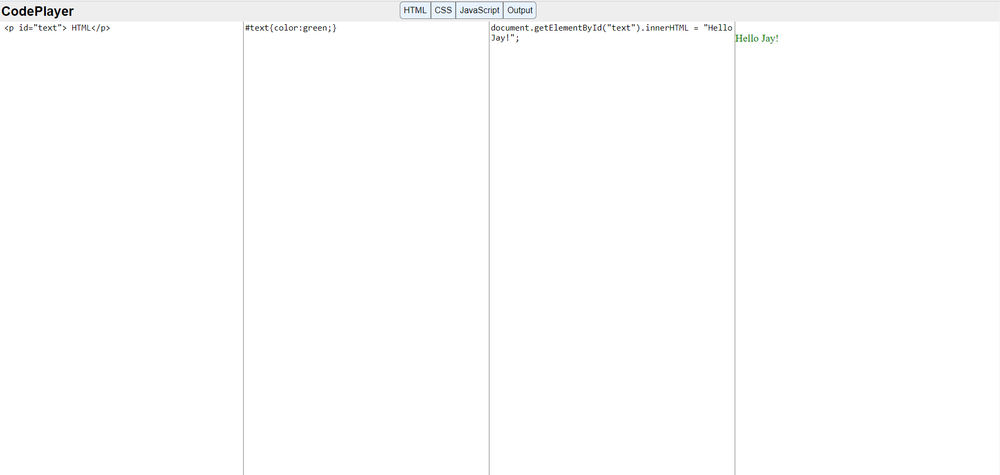

# Code-Player-using-JQuery
Code Player is a web application built using JQuery. This app is basically a replication of the site jsbin.com, which is used to debug user's HTML, CSS and Javascript codes within the web page itself.

It has a nav-bar with 'htnl', 'css', 'javascript', 'output' toggalable buttons. html and output buttons are fixed. 

 once they are clicked the site automatically resizes based on the number of active buttons 

 The ouptut window is an iframe where it displays the output 

As soon as user writes some code in any of the panel it automatically updates in the iframe i.e., in output window 

 .eval() is used to execute javascript code, .val() is used for html and css codes 

 toggle classes are added using jquery 
 

<h3 style="color:blue;">Application </h3>

